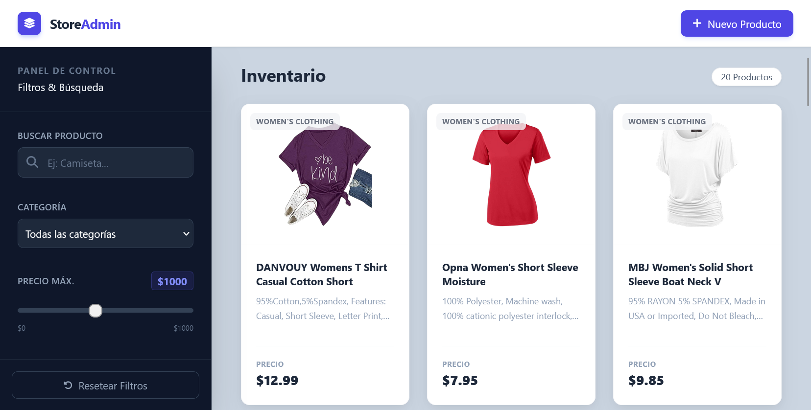
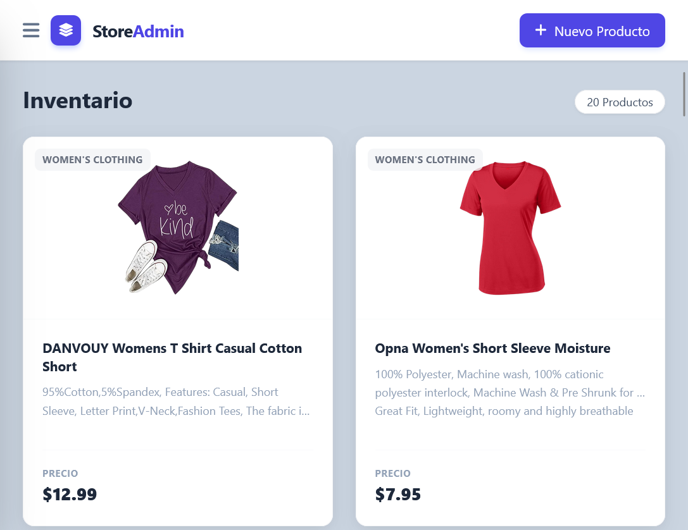
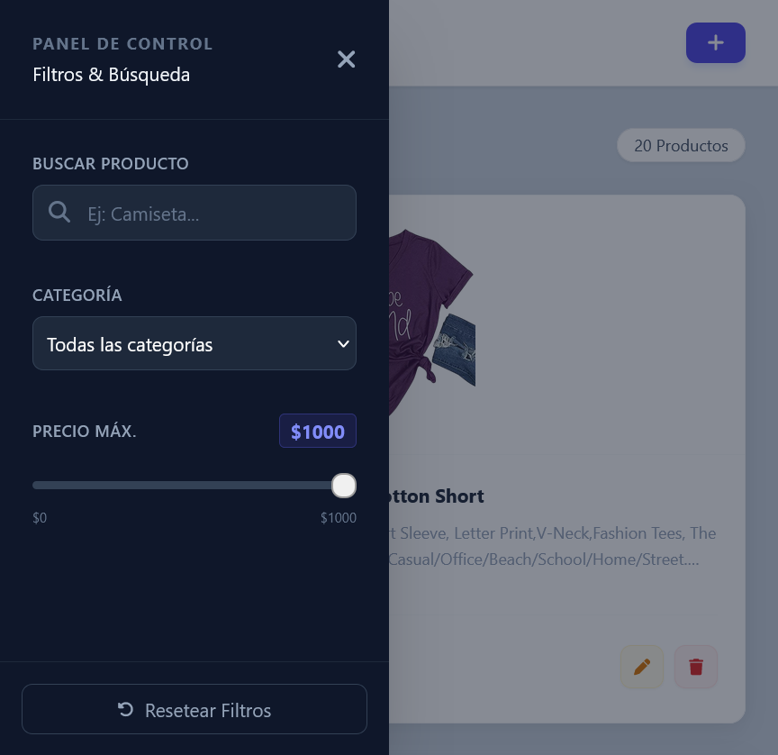

# 🚀 FakeStore Admin Dashboard

Una interfaz moderna de administración de productos (CRUD) construida con **JavaScript Vanilla** y **Tailwind CSS**, consumiendo la API pública [FakeStoreAPI](https://fakestoreapi.com/).

--- 

### Vista Previa del Dashboard
#### **Desktop:**

#### **Tablet:**


#### **Mobile:**



---

## 📋 Descripción

Este proyecto es una **Single Page Application (SPA)** que simula un panel de control (Dashboard) para una tienda de comercio electrónico. Permite gestionar el inventario mediante operaciones CRUD, filtrar productos en tiempo real y buscar por nombre, todo bajo una interfaz de usuario elegante y responsiva.

El objetivo principal fue aplicar conceptos avanzados de manipulación del DOM, consumo de APIs RESTful y diseño UI/UX moderno sin utilizar frameworks reactivos (como React o Vue).

## 🛠️ Tecnologías Utilizadas

*   **HTML5:** Estructura semántica.
*   **Tailwind CSS (CDN):** Estilizado rápido, sistema de Grid/Flexbox y diseño responsivo.
*   **JavaScript (ES6+):** Lógica de negocio, manejo de estado asíncrono (`async/await`) y manipulación del DOM.
*   **FontAwesome:** Iconografía para mejorar la UX.
*   **API:** [FakeStoreAPI](https://fakestoreapi.com/) (Backend simulado).

## ✨ Funcionalidades Principales

### 1. Gestión de Productos (CRUD)
*   **Leer (GET):** Carga inicial de productos desde la API.
*   **Crear (POST):** Formulario en ventana modal para agregar nuevos ítems.
*   **Actualizar (PUT):** Edición de productos existentes con pre-llenado de datos.
*   **Eliminar (DELETE):** Borrado de productos con confirmación.

### 2. Filtrado y Búsqueda Avanzada (Client-Side)
A diferencia de la API básica, esta aplicación implementa lógica en el frontend para permitir:
*   🔎 **Búsqueda en vivo:** Filtra por nombre del producto mientras escribes.
*   🏷️ **Categorías:** Filtrado dinámico por tipo de producto.
*   💰 **Slider de Precio:** Ajuste de rango de precios máximo en tiempo real.

### 3. Diseño UI/UX "Premium"
*   **Dark Sidebar:** Barra lateral oscura para jerarquizar la navegación.
*   **Diseño Responsivo:** Se adapta de móviles (1 columna, sidebar oculta) a pantallas grandes (Grid de hasta 5 columnas).
*   **Micro-interacciones:** Efectos hover en tarjetas, transiciones suaves en botones y modales con `backdrop-blur`.
*   **Feedback Visual:** Loaders de carga, mensajes de "No hay resultados" y alertas de confirmación.

## 📂 Estructura del Proyecto

```text
├── index.html      # Estructura y clases de Tailwind
├── app.js          # Lógica, consumo de API y eventos
└── README.md       # Documentación
```